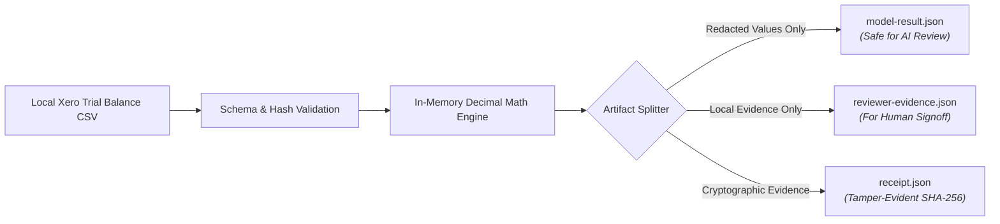

# Data-Flow & Zero-Network Privacy Guarantee

## 1. Purpose & Security Model
`ElizabethAnneAlexander` enforces a zero-network, local-only safety perimeter for reviewing sensitive accounting ledgers and trial balance exports.

## 2. Zero-Network Guarantee
- **No Inbound / Outbound Sockets**: The engine contains zero HTTP, socket, or cloud telemetry libraries.
- **No Cloud LLM Calls**: Data is processed in-memory locally.
- **Redaction-Before-Exposure**: Account display names, entity names, and identifying metadata are stripped or pseudonymised before any downstream agent artifact is generated.

## 3. Data Flow Model

