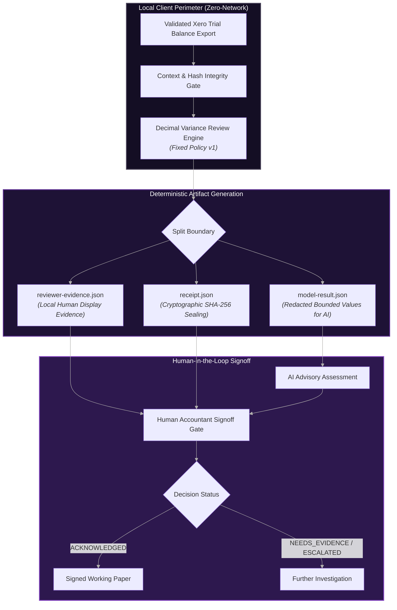

# xero-ai-review-gateway

```
+----------------------------------------------------------------------+
|                        xero-ai-review-gateway                        |
+----------------------------------------------------------------------+
|            Fixed policy zero network Xero review gateway             |
+----------------------------------+-----------------------------------+
| DR  what it gives you            | CR  what it needs                 |
+----------------------------------+-----------------------------------+
| redacted variance review         | a validated Xero TB export        |
| local human reviewer evidence    | a review policy JSON file         |
| zero network fixed policy        | -                                 |
+----------------------------------+-----------------------------------+
```

[](https://github.com/ryanduguid/xero-ai-review-gateway/actions/workflows/ci.yml)
[](https://pypi.org/project/elizabeth-anne-alexander/)
[](https://www.python.org/downloads/)
[](LICENSE)
[](DATA-FLOW.md)

A **fixed-policy, zero-network ledger-review boundary for AI**, not an AI that operates Xero.

The repository name is the public project identity; the `elizabeth-anne-alexander` distribution, import package and command remain compatibility identifiers.

`xero-ai-review-gateway` consumes validated Xero-shaped trial-balance exports and produces a bounded, redacted variance-review result alongside separate local human-reviewer evidence. It deliberately features **no network calls, no cloud telemetry, no LLM API clients, and zero accounting-system write operations**.

---

## Zero-Network Architecture



---

## Quick Demo

```bash
# Install package in editable development mode
pip install -e ".[dev]"

# Run deterministic evaluation
elizabeth-anne-alexander evaluate \
  --context samples/contexts/sample-monthly-variance.context.json \
  --request samples/requests/sample-revenue-variance.request.json \
  --policy policy/demo-policy-v1.json \
  --out build/demo
```

### Validate Human Review Signoff
```bash
elizabeth-anne-alexander validate-review \
  --evidence build/demo/reviewer-evidence.json \
  --receipt build/demo/receipt.json \
  --decision samples/decisions/sample-review-decision.json
```

---

## Control boundary

- The canonical source contract has exactly ten columns: `ReportDate,Tenant,Section,AccountID,AccountName,AccountCode,Debit,Credit,YTDDebit,YTDCredit`.
- CSV schema, duplicate account IDs, reporting dates, balance pairs, source hashes, entity, basis, currency, tracking filters, and draft setting are all checked before review.
- Monetary values use `Decimal`, never binary floating point.
- `percent_change` in the model result is expressed in percent and quantized to four decimal places (`"18.3333"` means 18.3333%). It is `null` when there is no prior balance to compare against.
- The model result states its own `currency` and `sign_convention`. Amounts are debit-positive (`ytd_net = YTDDebit - YTDCredit`), so a revenue, liability, or equity balance is negative and a revenue increase shows as a negative `delta`.
- Current and prior reports must sit in the same Australian financial year, or be the same day and month in different years. YTD columns reset on 1 July, so a comparison across the reset would report a whole prior-year balance as a movement.
- Current/prior trial balances are joined by stable `AccountID`, not account display name or code.
- An account changing section between periods fails closed instead of disappearing from, or being silently reclassified within, a section-scoped comparison.
- The model result never contains a tenant name, account name, account code, source file path, token, raw error, or free text copied from source data.
- Artefact timestamps (`export.generated_at`, `reviewed_at`) are accepted as `YYYY-MM-DD`, then `T`, `t`, or a space, then `HH:MM` with optional `:SS` and optional `.` plus one to six fractional digits, then `Z`, `z`, or `+/-HH:MM` with optional `:SS`. The gateway fixes that grammar itself rather than inheriting `datetime.fromisoformat`, whose accepted forms widened in Python 3.11: a bare `+10` offset, a week date, a basic-format `20260809T000000+0000`, and a fraction longer than six digits are refused on every interpreter, as is a separator character other than `T`, `t`, or a space.
- The three run artefacts are staged beside their destinations and moved into place only once all three are written, receipt last. The moves are not one atomic step, so an interrupted run can still leave one new file beside two old ones; `validate-review` refuses that pack, because the receipt seals both the reviewer evidence and the model result sitting beside it.
- The package contains no network imports or mutation adapter. A future live connection must remain an authorised, read-only export handoff rather than an AI-controlled broad Xero tool set.

## Scope and limitation

Every source manifest, review context, model result, reviewer evidence, and receipt is marked `mode: synthetic`. The policy, request, and human-decision files carry no `mode` key: each is validated against an exact key set, so adding one is rejected. The `validate-review` output carries no `mode` key either; it reports the decision status for a run whose artefacts were already checked. It is a local design demonstration, not a client-data processor, production security system, accounting service, or professional opinion. The reviewer evidence/model-result file split demonstrates disclosure minimisation only; it is not an access-control mechanism by itself.

## Documentation & Governance

- [`DATA-FLOW.md`](./DATA-FLOW.md) – Formal data-flow and zero-network security specification.
- [`CITATION.cff`](./CITATION.cff) – Academic and industry citation metadata.
- [`LICENSE`](./LICENSE) – MIT License.
